# **Finding Lane Lines on the Road** 


This project helps to detect lane lines in images using Python and OpenCV and then applying it for videos as an end goal.

---

### Table of Contents
  1. [Libraries and Packages](#1-libraries-and-packages)
  2. [Finding Lane Lines](#2-finding-lane-lines)
     - [Modifying `draw_lines()` Function](#modifying-draw_lines-function)
  3. [Potential Shortcomings with Current Pipeline](#3-potential-shortcomings-with-current-pipeline)
  4. [Possible Improvements to Pipeline](#4-possible-improvements-to-pipeline)
  5. [Conclusion](#5-conclusion)
  6. [License](#6-license)

---

### 1. Libraries and Packages
The following libraries and packages have been used in this project: **`scipy`**, **`matplotlib.pyplot`**, **`matplotlib.image`**, **`numpy`**, **`cv2`**, **`sklearn.linear_model`**, **`sklearn.preprocessing`**, **`sklearn.pipeline`**, **`moviepy.editor`**, and **`IPython.display`**.

### 2. Finding Lane Lines

First of all I started using the simple methods for making a pipeline, as described in the course. The steps were as following:
  
  1. Converting the RGB image to a Grayscale image using `cv2.cvtColor()`.
  2. Applying `cv2.GaussianBlur()` to make the image smoother.
  3. Applying the OpenCV Canny edge detection function, `cv2.Canny()`, to find edges in the image
  4. Creating and applying a mask to find the region of interest. The region of interest includs the lane line which the car is moving on. 
     - It helps to remove other objects on the image that are redundant and make it easier to make pipelines.
  5. Applying _Hough Transform_ on the edge detected image to find lines.
  6. Modifying the `draw_lines()` function to make pipelines on the image. 
     - I will describe how to modify `draw_lines()` function later.

You can change/adjust the parameters of _Canny_ or _Hough Transform_ functions to find pipelines for the test images. But when it comes to the videos, especially the challange video, it's not able to find pipelines for the all frames accurately!

Before explaining _the steps to improve lane line detection_ I will describe `draw_lines()` function modification steps.


####  Modifying `draw_lines()` Function
In order to draw a single line on the left and right lanes, I modified the `draw_lines(img, lines, color=[255, 0, 0], thickness=8)` function by calculating the left line and the right lane slopes. Then I drew a solid line with the calculated slope. To accomplish that the steps are as following:
  1. **Calculate the average of positive slopes and negative slopes separately.** In most cases the left line has a negative (-) slope and the right line has a positive (+) slope. So, this step gives us a good estimate of the final line slopes.
      ```python
     slopes = [((y2-y1)/(x2-x1)) for line in lines for x1,y1,x2,y2 in line]
     lane_slopes_right = np.average(np.array([m for m in slopes if m > 0]))
     lane_slopes_left = np.average(np.array([m for m in slopes if m < 0]))
      ```
  2. **Find the left and right lines.** To define a line uniquely, only **line slope** and **a point on the line** are needed. I created a function called `get_line(slope, x0, y0, y_min, y_max)` to define a line with its parameters and make it reusable.
        ```python
     def get_line(slope, x0, y0, y_min, y_max):
            x1 = int(x0 + (y_max - y0) / slope)
            x2 = int(x0 + (y_min - y0) / slope)
            return x1, y_max, x2, y_min
        ```
        This function gets the line parameters (`slope`, `x0`, `y0`) and range of line (`y_min`, `y_max`) and returns the _start point_ (`x1, y_max`) and the _end point_ (`x2, y_min`) of the line.
  3. **Finding line parameters `slope, x0, y0, y_min, y_max`.** We know the line `slope` from first step. So, it's time to find the rest!
  
        i. Categorize the left and right lines.
        ```python
     lines_left = [line for line in lines for x1,y1,x2,y2 in line if ((y2-y1)/(x2-x1)) < 0]
     lines_right = [line for line in lines for x1,y1,x2,y2 in line if ((y2-y1)/(x2-x1)) > 0]
        ```
        ii. Find the upper (a) and lower (b) points of each side. It helps to find `x0, y0, y_min, y_max`.
        ```python
     # Left side
     l_a_dict = {y1:x1 for line in lines_left for x1, y1, x2, y2 in line}
     l_a_y = min(l_a_dict, key=l_a_dict.get)
     l_a = [l_a_dict[l_a_y], l_a_y]
     l_b_dict = {y2:x2 for line in lines_left for x1, y1, x2, y2 in line}
     l_b_y = max(l_b_dict, key=l_b_dict.get)
     l_b = [l_b_dict[l_b_y], l_b_y]
     
     # Right side
     r_a_dict = {y1:x1 for line in lines_right for x1, y1, x2, y2 in line}
     r_a_y = min(r_a_dict, key=r_a_dict.get)
     r_a = [r_a_dict[r_a_y], r_a_y]
     r_b_dict = {y2:x2 for line in lines_right for x1, y1, x2, y2 in line}
     r_b_y = max(r_b_dict, key=r_b_dict.get)
     r_b = [r_b_dict[r_b_y], r_b_y]
     ```
        I used `l_b` and `r_b` as `x0, y0` for the left and the right lines respectively.
        
      iii. Finding vertical range of lines `y_min, y_max`.
        ```python
     ymin = min(l_b_y, r_a_y)
     ymax = max(l_a_y, r_b_y)
        ```
  4. **Add a single line to the image as the left pipeline.** I used `cv2.line()` function for adding a line to the image.
        ```python
        l_x1, l_y1, l_x2, l_y2 = get_line(lane_slopes_left, l_b[0], l_b[1], ymin, ymax)
        cv2.line(img, (l_x1, l_y1), (l_x2, l_y2), color, thickness)
        ```
        Do the same thing for the right side:
        ```python
        r_x1, r_y1, r_x2, r_y2 = get_line(lane_slopes_right, r_a[0], r_a[1], ymin, ymax)
        cv2.line(img, (r_x1, r_y1), (r_x2, r_y2), color, thickness)
        ```
        `weighted_img()` also could be used instead of `cv2.line()` for adding translucent pipelines to the original image.

### 3. Potential Shortcomings with Current Pipeline
Before improving the lane line detection code, potential shortcomings need to be identified. There are two important shortcoming here:
  1. **Color selection:** The algorithm for color selection is quite simple and it's useless, for instance, when the brightness of the image is high or the contrast is low or there is a light-color object on the road close to the lane line sides, etc.
  2. **Finding the solid left and right lines:** The road isn't always straight and it turns to the left an right. So, _striaght pipeline_ is a wrong assumption. The truth is that a pipeline is actually a curve!
  
### 4. Possible Improvements to Pipeline
First step is to _improve the color selection algorithm_ and second step is _estimating the best possible curve line for the pipeline_. For the rest of this section I use `test_images/whiteCarLaneSwitch.jpg` to show result of each step.

<br/>
<figure>
    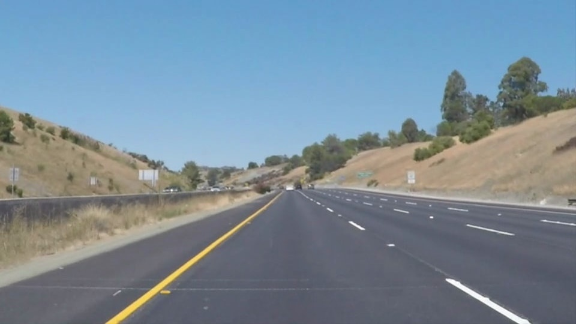
    <figcaption>
        <p></p> 
        <p style="text-align: center;"> <i> The image which is used to show result of each step. </i> </p> 
    </figcaption>
</figure>

#### Color Selection
A possible improvement would be using a different color space like HLS instead of RGB for selecting white and yellow colors. Another one is that do this separately for each color!

##### Different Color Space
To start, I created `copy_hls()` function for converting color space from `RGB` to `HLS`. 
```python
def copy_hls(image):
    img = np.copy(image)
    # Convert BGR to HLS
    hls = cv2.cvtColor(img, cv2.COLOR_RGB2HLS)
    return hls
```

> **Note:** It is a good practice to initially create a copy of the source image and then make changes to the copied version instead of the main version.

##### White and Yellow Mask
The  `get_white_yellow_mask(img)` function generates a mask to filter out almost every objects that doesn't have white or yellow colors. Using the lower and upper range of color and `cv2.inRange()` the mask for the a given color could be found. `mask_y` for the yellow objects:
```python
# Convert BGR to HLS
img_hls = copy_hls(img)

# Yellow mask
# define range of yellow color in HLS color space
lower_range = np.array(y_lower, dtype=np.uint8)
upper_range = np.array(y_upper, dtype=np.uint8)

# Apply the range values to the HLS image to get only yellow colors
mask_y = cv2.inRange(img_hls, lower_range, upper_range)
```
and `mask_w` for the white color objects:
```python
# White mask
# define range of white color in HLS color space
lower_range = np.array(w_lower, dtype=np.uint8)
upper_range = np.array(w_upper, dtype=np.uint8)

# Apply the range values to the HLS image to get only white colors
mask_w = cv2.inRange(img_hls, lower_range, upper_range)
```
> At the end of section 3, I will explain about lower and upper ranges of yellow and white colors.

Then mix `mask_y` and `mask_w` to a single mask for both colors using `cv2.bitwise_or()`.
```python
# Mix the generated masks
mask_wy = cv2.bitwise_or(mask_y, mask_w)
idx = mask_wy != 0
mask_wy[idx] = 255
```

The result is as following:

<table style="width:100%; text-align: center;">
  <tr>
    <td>
        <figure>
            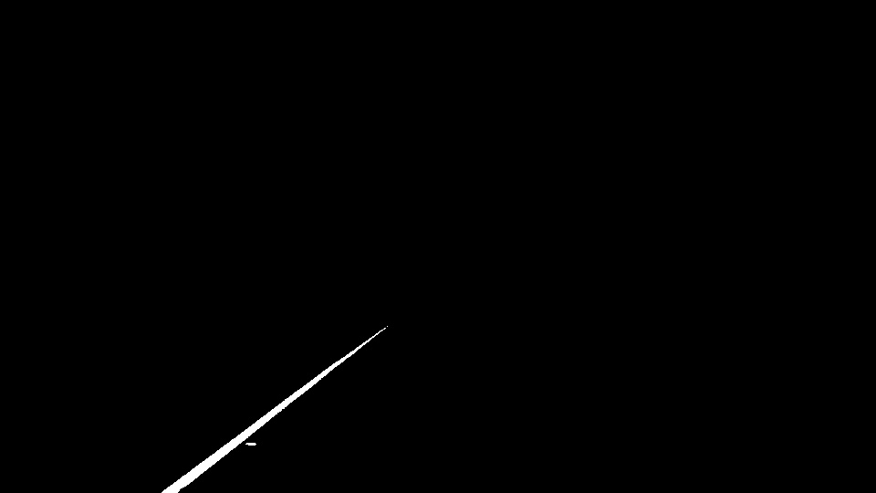
            <figcaption>
                <p></p> 
                <p style="text-align: center;"> <i> `mask_y`: Yellow color mask </i></p> 
            </figcaption>
        </figure>
    </td>
    <td>
        <figure>
            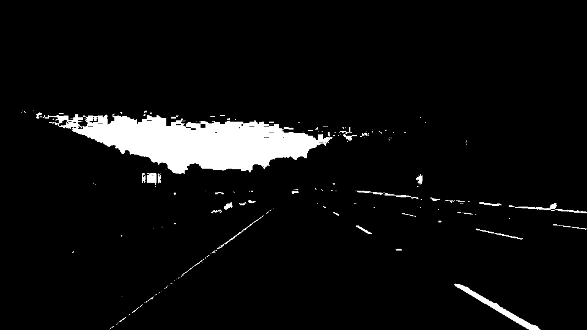
            <figcaption>
                <p></p> 
                <p style="text-align: center;"> <i> `mask_w`: White color mask </i></p> 
            </figcaption>
        </figure>
    </td>
  </tr>
  <tr>
    <td colspan="2">
        <figure>
            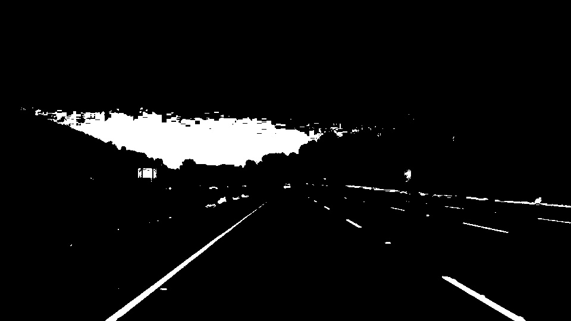
            <figcaption>
            <p></p> 
            <p style="text-align: center;"> <i> `mask_wy`: Mixed mask for both yellow and white </i> </p> 
            </figcaption>
        </figure>
    </td>
  </tr>
</table>

#### Canny Edge Detection
The `get_canny(img, mask)` function creates a convenient canny image. By using `mask` we can extract the regions in the image that includes white and/or yellow objects. I call it `region_of_interest`.
```python
region_of_interest = cv2.bitwise_and(img, mask)
```
Then I made it a little bit blur to reduce the noise of the image which also helps gaining a better canny image.
```python
region_of_interest_blur = gaussian_blur(region_of_interest, kernel_size)
```
At the end, I converted it to a canny image using `canny` function. It's one of helper functions and it uses 
```python
region_of_interest_canny = canny(region_of_interest_blur, canny_low_threshold, canny_high_threshold)
```

You can see the results below:

<table style="width:100%; text-align: center;">
  <tr>
    <td>
        <figure>
            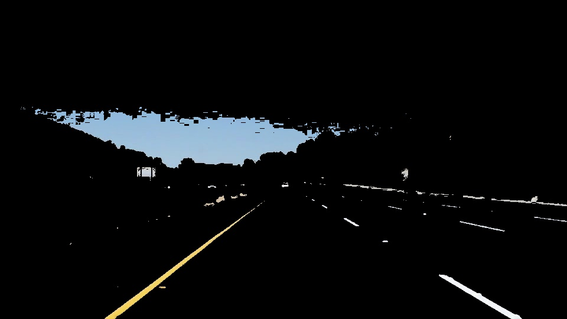
            <figcaption>
                <p></p> 
                <p style="text-align: center;"> <i> `region_of_interest` : The region of interest</i></p> 
            </figcaption>
        </figure>
    </td>
    <td>
        <figure>
            
            <figcaption>
                <p></p> 
                <p style="text-align: center;"> <i> `region_of_interest_blur`: The blurred region of interest to reduce the noise</i></p> 
            </figcaption>
        </figure>
    </td>
  </tr>
  <tr>
    <td colspan="2">
        <figure>
            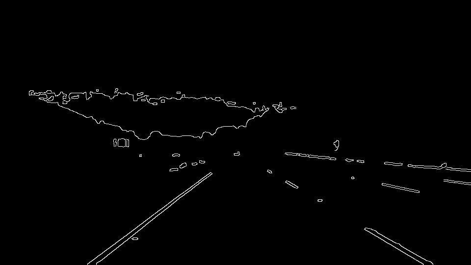
            <figcaption>
            <p></p> 
            <p style="text-align: center;"> <i>  `region_of_interest_canny`: Canny edge detected image </i> </p> 
            </figcaption>
        </figure>
    </td>
  </tr>
</table>

#### Transforming the Lane Area to a Rectangle
To simplify, the lane area in canny image is transformed to a rectangle. For this purpose `transform_to_rectangle()` has been used. In order to implement this function `cv2.getPerspectiveTransform()` and `cv2.warpPerspective()` of OpenCV are used.
<br/>
<table style="width:100%; text-align: center;">
  <tr>
    <td>
        <figure>
            
            <figcaption>
                <p></p> 
                <p style="text-align: center;"> <i> Canny edge detected image</i></p> 
            </figcaption>
        </figure>
    </td>
    <td>
        <figure>
            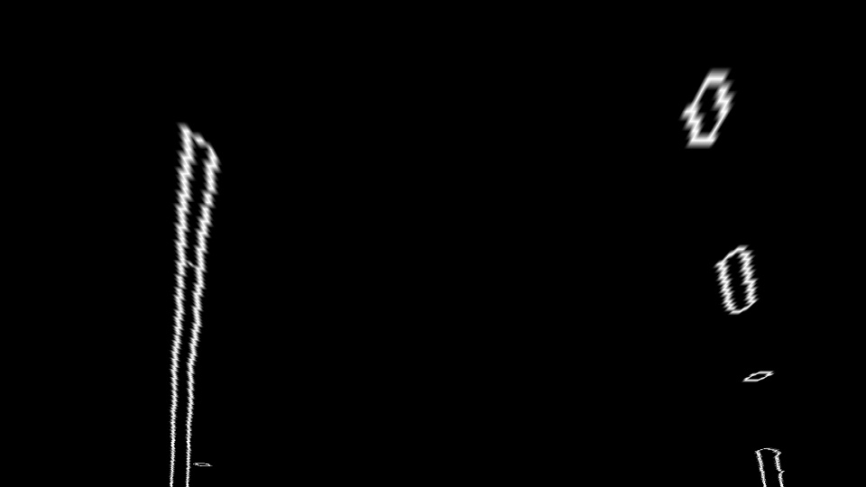
            <figcaption>
                <p></p> 
                <p style="text-align: center;"> <i> Transforming the lane line area to the rectangle </i></p> 
            </figcaption>
        </figure>
    </td>
  </tr>
</table>

#### Separating the Left and Right Sides
Before finding the left and right curved pipelines, I separated the left and right lines using `separate_to_left_right()` as following:

<table style="width:100%; text-align: center;">
  <tr>
    <td colspan="2">
        <figure>
            
            <figcaption>
            <p></p> 
            <p style="text-align: center;"> <i>  Transforming the lane line area to the rectangle </i> </p> 
            </figcaption>
        </figure>
    </td>
  </tr>
  <tr>
    <td>
        <figure>
            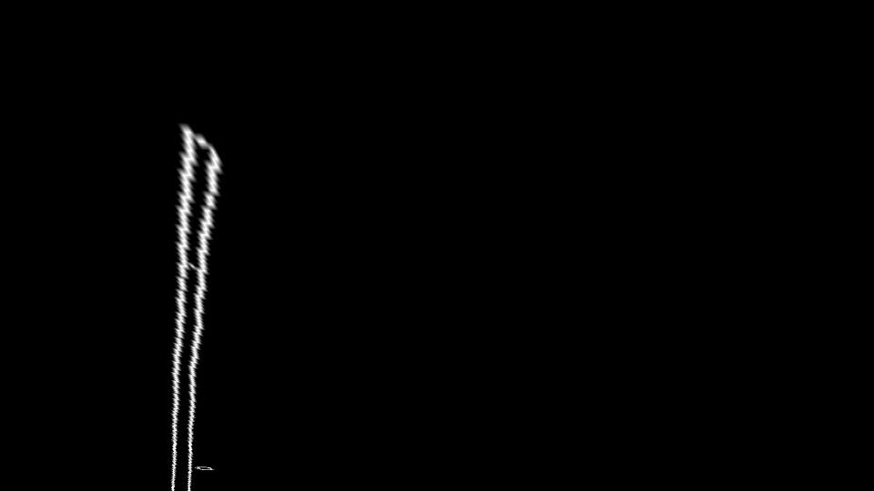
            <figcaption>
                <p></p> 
                <p style="text-align: center;"> <i> Used for finding the left curved line</i></p> 
            </figcaption>
        </figure>
    </td>
    <td>
        <figure>
            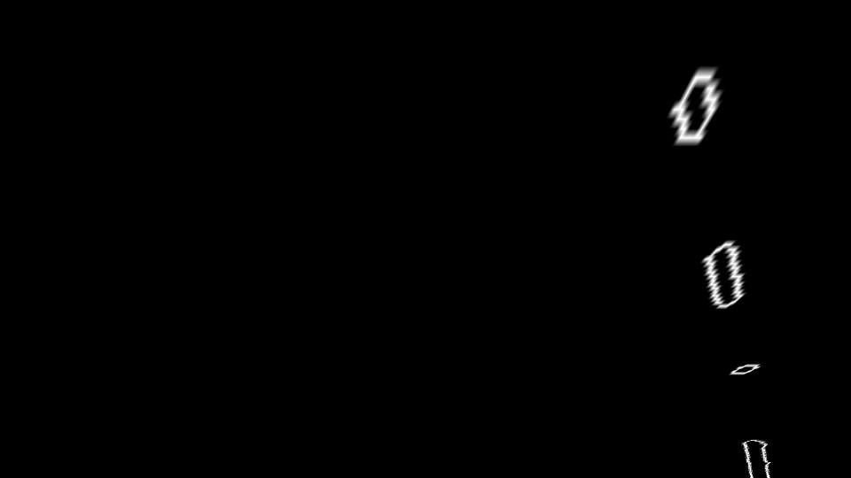
            <figcaption>
                <p></p> 
                <p style="text-align: center;"> <i> Used for finding the right curved line </i></p> 
            </figcaption>
        </figure>
    </td>
  </tr>
</table>

#### Hough Transform
Next step is applying _Hough Transform_ by using `find_hough_lines()` function to the both left and right side images. The results for each side is a set of lines and each line contains a couple of points that indicates the starting and ending points of it.
You can see these points below:
<table style="width:100%; text-align: center;">
  <tr>
    <td>
        <figure>
            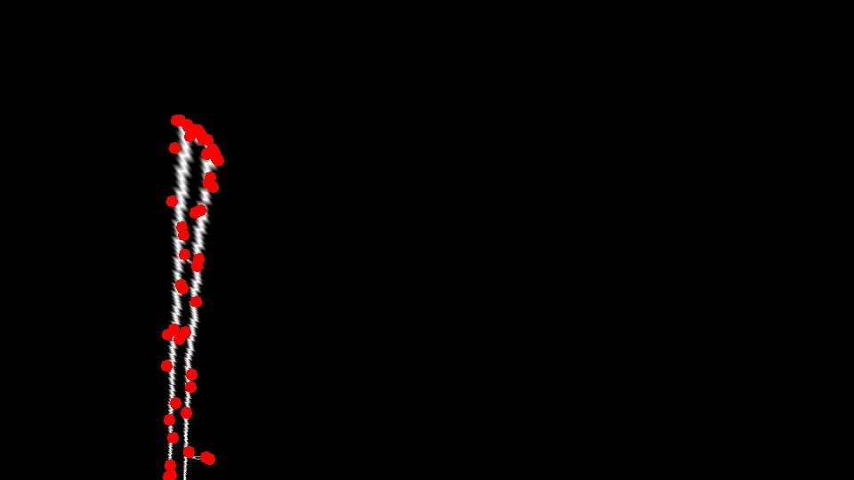
            <figcaption>
                <p></p> 
                <p style="text-align: center;"> <i> The starting and ending points of Hough Transform lines for the left side </i></p> 
            </figcaption>
        </figure>
    </td>
    <td>
        <figure>
            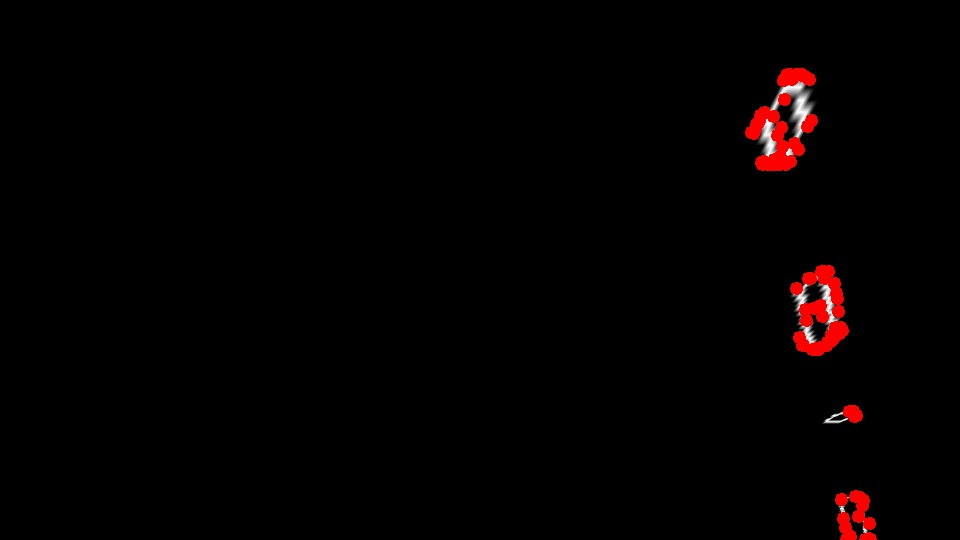
            <figcaption>
                <p></p> 
                <p style="text-align: center;"> <i> The starting and ending points of Hough Transform lines for the right side </i></p> 
            </figcaption>
        </figure>
    </td>
  </tr>
</table>

#### Find the Best Line with Polynomial Interpolation
`scikit-learn` has some pakcages for Polynomial Interpolation (see an example [here](http://scikit-learn.org/stable/auto_examples/linear_model/plot_polynomial_interpolation.html)). In fact, I used linear regression with polynomial features to approximate a nonlinear function that fits the points which were found from the previous step. I used the following packages:
```python
from sklearn.linear_model import Ridge
from sklearn.preprocessing import PolynomialFeatures
from sklearn.pipeline import make_pipeline
```
The function that is responsible to fit the best line is `find_pipeline`. The polynomial with a degree equal to 2 gives the best results. If you increase or decrease the degree of polynomial, the underfitting and overfitting problems occur. For more information see [here](http://scikit-learn.org/stable/auto_examples/model_selection/plot_underfitting_overfitting.html#sphx-glr-auto-examples-model-selection-plot-underfitting-overfitting-py). Finally, the calculated pipeline formula would be used to draw pipelines using `draw_pred_lines()` function (image below).
<br/>
<table style="width:100%; text-align: center;">
  <tr>
    <td>
        <figure>
            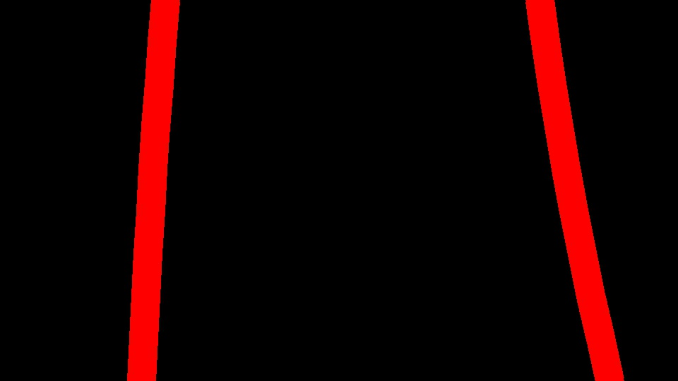
            <figcaption>
                <p></p> 
                <p style="text-align: center;"> <i> The calculated pipelines </i></p> 
            </figcaption>
        </figure>
    </td>
  </tr>
</table>

> I created a `buffer_model` for the calculated pipeline models. In each step after calculating the model I stored them (left and right models) in this buffer. And they will be used to a more accurate estimation of the pipelines for the next frame. To clarify, assume we have **two first frames** of a video: `F1` and `F2`. The steps are as following:
>  1. Calculate the pipeline predict model for `F1` (`pred_model_1`).
>  2. Use this `pred_model_1` to add an estimated pipelines to `F1`.
>  3. Add it to the buffer.
>  4. Next frame (`F2`) comes for estimation.
>  5. Calculate the pipeline predict model for `F2`(`pred_model_2`).
>  6. Use `pred_model_1` and `pred_model_2` to add an estimated pipelines to `F2`.
>     - If deviation of a point on the pipe line 2 with respect to the same point on the line 1 exceeds a specified threshold, `th_0`, replace it with a point which has a deviation equal to the `th_0` otherwise do nothing.
>
> The step 6 really makes the changes of curvature smooth.

#### Adding The Green Zone and Retransform it to the Original Shape
The safe driving area for a car is the area between the pipelines that I call it "Green Zone." Let's fill the area between red pipelines with the green color using `add_green_zone()` function. For implementing this function I used `cv2.fillPoly()` from OpenCV (figure below). Then retransform it to the original perspective using `transform_back_to_origin()`. The results are as following:
<br/>
<table style="width:100%; text-align: center;">
  <tr>
    <td>
        <figure>
            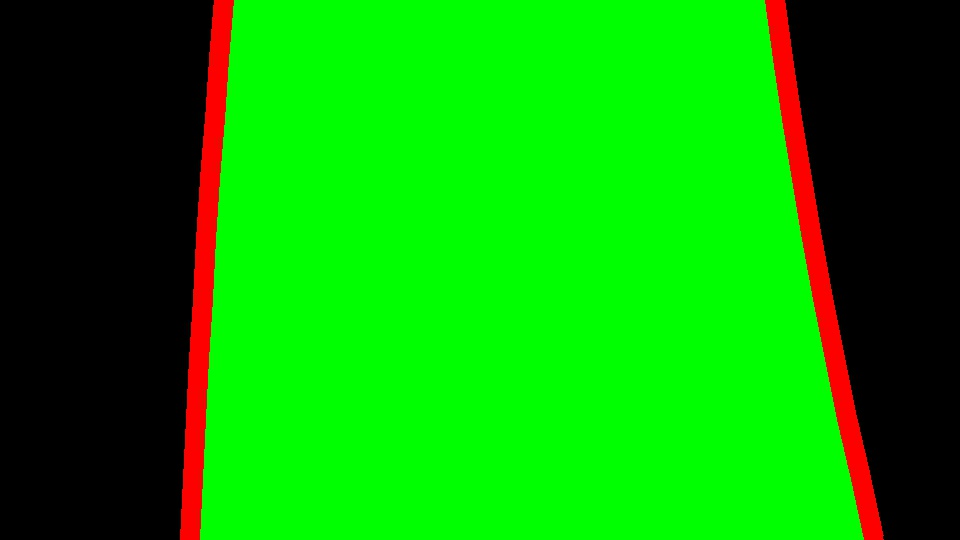
            <figcaption>
                <p></p> 
                <p style="text-align: center;"> <i> The calculated pipelines with green zone</i></p> 
            </figcaption>
        </figure>
    </td>
    <td>
        <figure>
            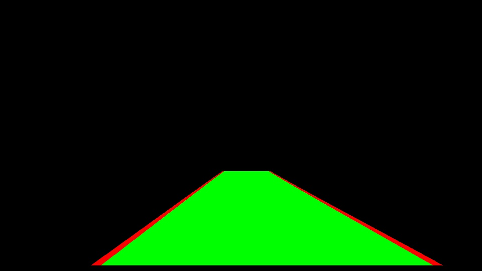
            <figcaption>
                <p></p> 
                <p style="text-align: center;"> <i> Transformed result </i></p> 
            </figcaption>
        </figure>
    </td>
  </tr>
</table>

#### Adding the Pipelines with Green Zone to the Original Image
This is a time for adding the pipeline with green zone to the original image. `weighted_img()` function adds a translucent version to the original image (figure below).
<br/>
<table style="width:100%; text-align: center;">
  <tr>
    <td>
        <figure>
            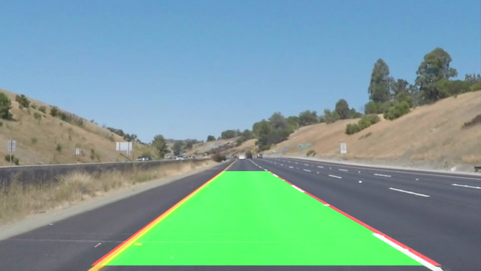
            <figcaption>
                <p></p> 
                <p style="text-align: center;"> <i> The final result </i></p> 
            </figcaption>
        </figure>
    </td>
  </tr>
</table>

#### `find_pipelines_and_green_zone()` Function
`find_pipelines_and_green_zone()` function (including all the mentioned steps) adds pipe lines and green zone to a given road image. You can see this function below:
```python
def find_pipelines_and_green_zone(img):
    mask = get_white_yellow_mask(img)
    
    canny = get_canny(img, mask)

    rows,cols,ch = img.shape
    img_trans = transform_to_rectangle(canny, rows, cols)
    img_left, img_right = separate_to_left_right(img_trans)
    
    lines_left, lines_right = find_hough_lines(img_left, img_right)
    
    len_x_history = 40
    len_x_plot = 10
    x_history = np.int16(np.linspace(0, rows - 1, len_x_history))
    x_plot = np.int16(np.linspace(0, rows - 1, len_x_plot)) 
    y_plot_left, y_plot_right = find_pipeline(rows, cols, lines_left, lines_right, x_history, x_plot)
    
    # Draw lines
    line_width = 40
    img_lines = draw_pred_lines(rows, cols, y_plot_left, y_plot_right, x_plot, line_width)
    img_green_zone = add_green_zone(img_lines, y_plot_left, y_plot_right, x_plot)
    
    # Transform region of interest
    img_trans_back = transform_back_to_origin(img_green_zone, rows, cols)
        
    # Add it to the original image
    final = weighted_img(img, img_trans_back)
    return final
```

#### Test Images
The result of the other test images are as following:

<table style="width:100%; text-align: center;">
  <tr>
    <td>
        <figure>
            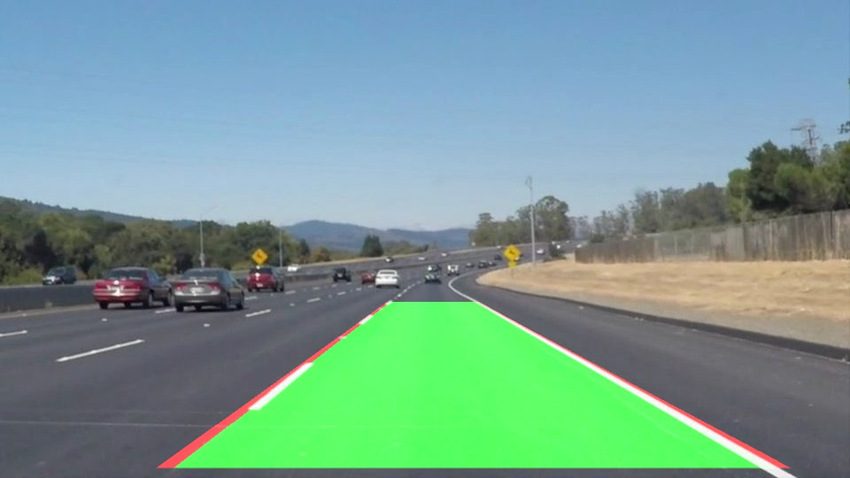
            <figcaption>
                <p></p> 
                <p style="text-align: center;"> <i> solidWhiteCurve.jpg </i></p> 
            </figcaption>
        </figure>
    </td>
    <td>
        <figure>
            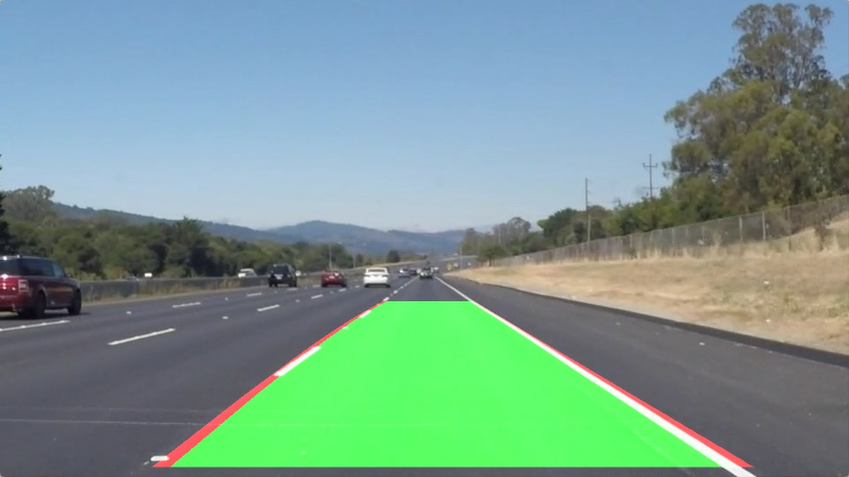
            <figcaption>
                <p></p> 
                <p style="text-align: center;"> <i> solidWhiteRight.jpg </i></p> 
            </figcaption>
        </figure>
    </td>
  </tr>
  <tr>
    <td>
        <figure>
            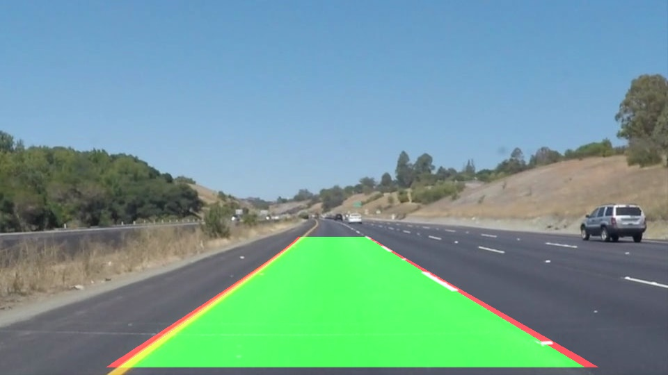
            <figcaption>
                <p></p> 
                <p style="text-align: center;"> <i> solidYellowCurve.jpg </i></p> 
            </figcaption>
        </figure>
    </td>
    <td>
        <figure>
            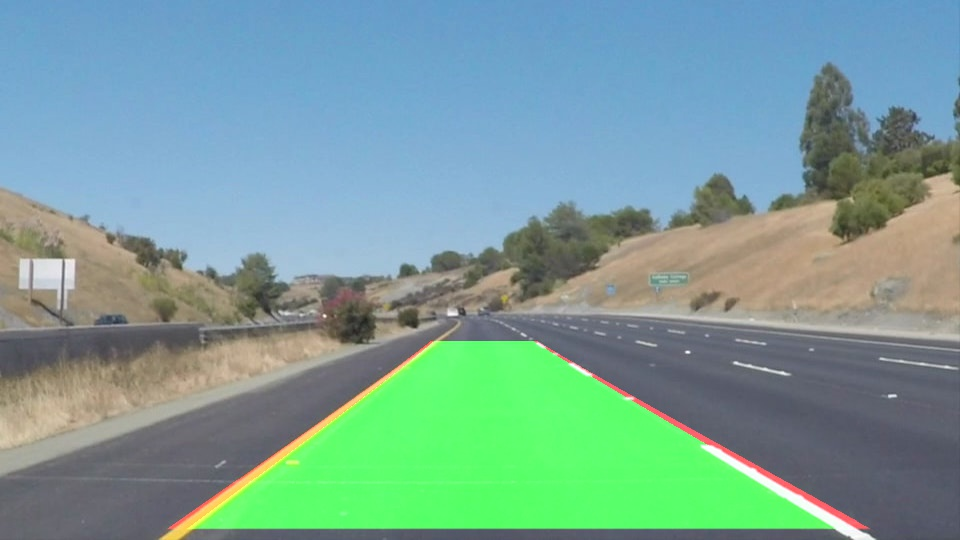
            <figcaption>
                <p></p> 
                <p style="text-align: center;"> <i> solidYellowCurve2.jpg </i></p> 
            </figcaption>
        </figure>
    </td>
  </tr>
  <tr>
    <td>
        <figure>
            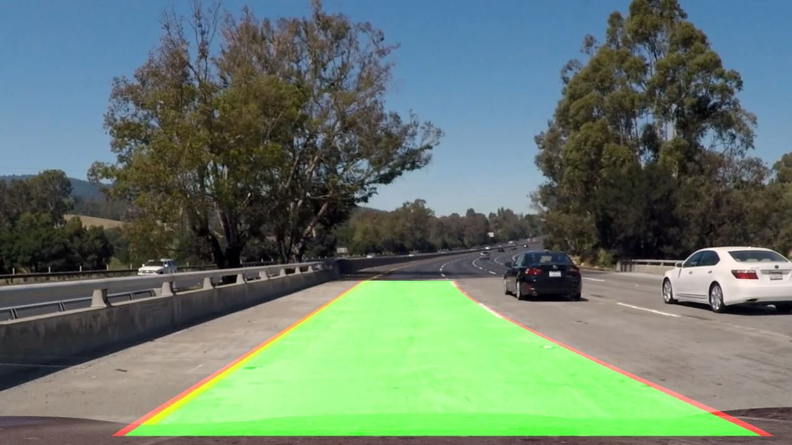
            <figcaption>
                <p></p> 
                <p style="text-align: center;"> <i> solidYellowCurveChal.jpg </i></p> 
            </figcaption>
        </figure>
    </td>
    <td>
        <figure>
            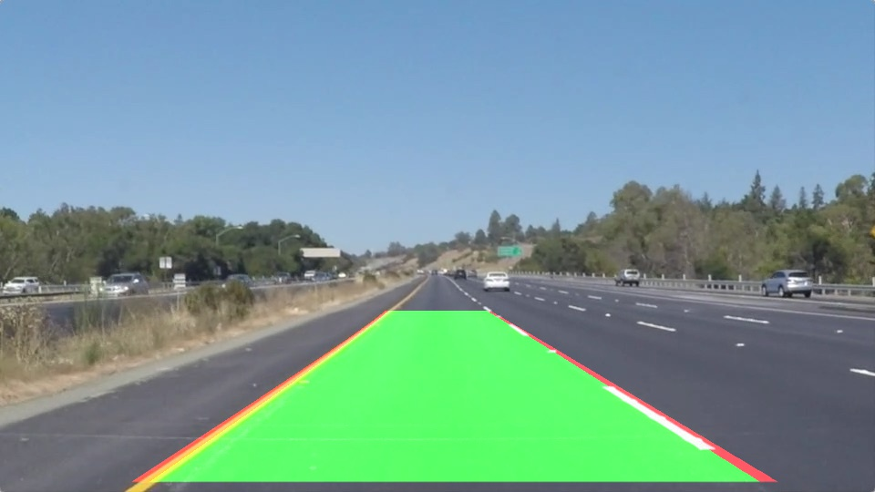
            <figcaption>
                <p></p> 
                <p style="text-align: center;"> <i> solidYellowLeft.jpg </i></p> 
            </figcaption>
        </figure>
    </td>
  </tr>
</table>

#### Tuning the Parameters
I put the parameters for different parts of this code in one place to tune them conveniently. The final result for these parameters are as following:
```python
# Color in range 
y_lower = [10, 0, 120]
y_upper = [40, 255, 255]
w_lower = [16, 182, 0]
w_upper = [255, 255, 255]

# Transform
coef_w_top = 0.15
coef_w_dwn = 1.00
offset_v_top = 0.63
offset_v_dwn = 0.02

# Blur
kernel_size = 9

# Canny
canny_low_threshold = 0
canny_high_threshold = 255

# Make a blank the same size as our image to draw on
rho = 1                 # distance resolution in pixels of the Hough grid
theta = np.pi/180 * 0.5 # angular resolution in radians of the Hough grid
threshold = 10          # minimum number of votes (intersections in Hough grid cell)
min_line_len = 15       # minimum number of pixels making up a line
max_line_gap = 10       # maximum gap in pixels between connectable line segments

# Interpolation
degree = 2
```

These values has been tuned for all videos including the challenge video.

##### You can find the output videos [here](test_videos_output) or watch them online [here](https://www.youtube.com/watch?v=S0_758-sbnc&index=2&list=PLgjxKJEo-VjELoTEKXEjA8Vi7s5xZCzI9).


### 5. Conclusion
Using better approaches for "color selection" and "pipeline estimation" results to a more accurate output. Also using the buffer makes the changes of the pipeline curvature smoother.

### 6. License
[MIT License](LICENSE).


```python

```
